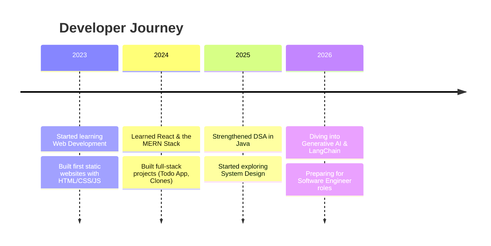

<div align="center">

<!-- ============ HERO BANNER ============ -->


<br/>

<a href="https://git.io/typing-svg">
  
</a>

<br/><br/>

<p>
  
  
  
</p>

<p>
  <a href="https://linkedin.com/in/your-linkedin"></a>
  <a href="mailto:your.email@example.com"></a>
  <a href="https://your-portfolio-link.com"></a>
  <a href="https://twitter.com/your-twitter"></a>
  <a href="https://leetcode.com/your-leetcode"></a>
</p>


</div>

<br/>

<!-- ============ ABOUT ME ============ -->
## 🧬 About Me

<table width="100%">
<tr>
<td width="55%" valign="top">

```yaml
saloni_paswan:
  role: "Full Stack Developer"
  location: "India 🇮🇳"
  focus:
    - MERN Stack Applications
    - Generative AI & LangChain
    - System Design Fundamentals
  goal: "Software Engineer @ a top product company"
  philosophy: "Ship fast, learn faster, iterate forever"
  status: "🟢 Open to full-time SWE opportunities"
```

</td>
<td width="45%" valign="top">

- 🎯 Building **production-grade MERN applications** with clean, scalable architecture
- 🤖 Actively exploring **AI Engineering** — LangChain, RAG pipelines, and LLM-powered apps
- 🧩 Strengthening **DSA & System Design** for high-growth product companies
- 🌱 Contributing to **open source** and writing maintainable, documented code
- ⚡ Passionate about **developer experience** and pixel-perfect UI
- 🤝 Collaborative engineer who thrives in fast-paced product teams

</td>
</tr>
</table>

<br/>

<!-- ============ TECH STACK ============ -->
## 🛠️ Tech Stack

<div align="center">

**Programming Languages**


**Frontend**


**Backend**


**Databases**


**AI & ML**


**Cloud**


**Tools**


**Version Control**


</div>

<br/>

<!-- ============ FEATURED PROJECTS ============ -->
## 🚀 Featured Projects

<table width="100%">
<tr>
<td width="50%">

### 🎧 Spotify Clone
A pixel-accurate Spotify UI clone with playlist browsing, playback controls, and responsive design.

**Stack:** `React` `Tailwind CSS` `Node.js`

**Features:**
- 🎵 Dynamic playlist rendering
- 📱 Fully responsive across devices
- ⚡ Optimized load performance

<p>
<a href="#"></a>
<a href="#"></a>
</p>

</td>
<td width="50%">

### 🎬 Netflix Clone
A Netflix-style streaming interface with dynamic content rows and trailer previews.

**Stack:** `React` `Firebase` `TMDB API`

**Features:**
- 🔥 Auto-fetched trending content
- 🔐 Firebase authentication
- 🎞️ Modal-based trailer previews

<p>
<a href="#"></a>
<a href="#"></a>
</p>

</td>
</tr>
<tr>
<td width="50%">

### 🌦️ Weather AI App
An AI-enhanced weather forecasting app that generates natural-language summaries of conditions.

**Stack:** `React` `OpenWeather API` `LangChain`

**Features:**
- 🤖 AI-generated weather summaries
- 📍 Geolocation-based forecasts
- 📊 7-day interactive forecast graph

<p>
<a href="#"></a>
<a href="#"></a>
</p>

</td>
<td width="50%">

### 📝 MERN Todo App
A full-stack task manager with authentication, categories, and real-time updates.

**Stack:** `MongoDB` `Express.js` `React` `Node.js`

**Features:**
- 🔐 JWT-based authentication
- 🗂️ Category-based task organization
- ⚡ Real-time UI updates

<p>
<a href="#"></a>
<a href="#"></a>
</p>

</td>
</tr>
<tr>
<td width="50%">

### 💼 Portfolio Website
A modern animated developer portfolio showcasing projects, skills, and resume.

**Stack:** `React` `Tailwind CSS` `Framer Motion`

**Features:**
- ✨ Smooth scroll animations
- 📄 Downloadable resume section
- 🌙 Dark/light mode toggle

<p>
<a href="#"></a>
<a href="#"></a>
</p>

</td>
<td width="50%">

### 🧮 Java DSA Repository
A structured collection of Data Structures & Algorithms solutions with explanations.

**Stack:** `Java`

**Features:**
- 📚 Topic-wise organized solutions
- 🧠 Time/space complexity notes
- ✅ 300+ problems solved

<p>
<a href="#"></a>
</p>

</td>
</tr>
</table>

<br/>

<!-- ============ FEATURED REPOSITORIES (Pinned-style) ============ -->
## 📦 Featured Repositories

<div align="center">


<br/>


</div>

<br/>

<!-- ============ GITHUB STATISTICS ============ -->
## 📊 GitHub Statistics

<div align="center">


<br/>


<br/><br/>


<br/><br/>


</div>

<br/>

<!-- ============ CONTRIBUTION HEATMAP ============ -->
## 🔥 Contribution Calendar

<div align="center">


</div>

<br/>

<!-- ============ GITHUB METRICS DASHBOARD ============ -->
## 📈 GitHub Metrics Dashboard

<div align="center">

```text
┌──────────────────────────────────────────────────────────┐
│  📦 Repos     🌟 Stars      🍴 Forks      👥 Followers    │
│  Auto-synced with live GitHub metrics via lowlighter/metrics │
└──────────────────────────────────────────────────────────┘
```

<!-- Generated via lowlighter/metrics GitHub Action -->


<sub>💡 Full interactive metrics dashboard generated nightly via GitHub Actions using <code>lowlighter/metrics</code></sub>

</div>

<br/>

<!-- ============ GITHUB SKYLINE 3D ============ -->
## 🌍 GitHub Skyline — My Contribution Journey in 3D

<div align="center">


<br/>

**🎮 Explore it interactively:** [skyline.github.com/SaloniPaswan](https://skyline.github.com/)

<sub>Every peak is a day of code, every valley a day of rest 🏔️</sub>

</div>

<br/>

<!-- ============ LEETCODE ============ -->
## 🧠 LeetCode Progress

<div align="center">


<br/><br/>

| 🟢 Easy | 🟡 Medium | 🔴 Hard | 🏆 Contest Rating |
|:---:|:---:|:---:|:---:|
| `Solved` | `Solved` | `Solved` | `Placeholder` |

</div>

<br/>

<!-- ============ ACHIEVEMENTS ============ -->
## 🏆 Achievements & Recognition

<div align="center">


<br/>

### 🎖️ Holopin Badges

 <sub>Placeholder — connect your Holopin board</sub>

<br/><br/>

### 📜 Certifications

<table width="80%">
<tr><td>🎓</td><td><b>MERN Stack Development</b> — Placeholder Provider</td></tr>
<tr><td>🎓</td><td><b>Generative AI & LangChain Fundamentals</b> — Placeholder Provider</td></tr>
<tr><td>🎓</td><td><b>Data Structures & Algorithms in Java</b> — Placeholder Provider</td></tr>
</table>

<br/>

### 🧑‍💻 Hackathons & Open Source

- 🥇 Participated in **[Hackathon Name]** — Placeholder
- 🌱 Active contributor to open-source MERN & AI tooling repositories
- 🤝 Regular PRs to community-driven developer projects

</div>

<br/>

<!-- ============ CURRENTLY WORKING ON ============ -->
## ⚙️ Currently Working On

<table width="100%">
<tr>
<td width="25%" align="center">

**🤖 Learning GenAI**
```
████████░░ 80%
```
LangChain · RAG · Prompt Engg.

</td>
<td width="25%" align="center">

**🛠️ Building AI Projects**
```
██████░░░░ 60%
```
AI-powered web apps

</td>
<td width="25%" align="center">

**🧩 Practicing DSA**
```
███████░░░ 70%
```
Java · Problem Solving

</td>
<td width="25%" align="center">

**🌐 Open Source**
```
█████░░░░░ 50%
```
Community contributions

</td>
</tr>
</table>

<br/>

<!-- ============ EXPERIENCE TIMELINE ============ -->
## 💼 Experience & Journey Timeline



<br/>

<!-- ============ 2026 GOALS TRACKER ============ -->
## 🎯 2026 Goals Progress

<table width="100%">
<tr><td width="70%">🚀 Land a Software Engineer role at a top product company</td><td width="30%">

```
██████░░░░ 60%
```
</td></tr>
<tr><td width="70%">🤖 Ship 3 production-grade AI-powered apps</td><td width="30%">

```
████░░░░░░ 40%
```
</td></tr>
<tr><td width="70%">🧩 Solve 500+ DSA problems</td><td width="30%">

```
███████░░░ 70%
```
</td></tr>
<tr><td width="70%">🌱 Make 50+ meaningful open-source contributions</td><td width="30%">

```
███░░░░░░░ 30%
```
</td></tr>
</table>

<br/>

<!-- ============ DEVELOPER PHILOSOPHY ============ -->
## 💭 Developer Philosophy

<div align="center">

> ### "Code is not just logic — it's empathy for the user, discipline for the team, and craft for yourself."


</div>

<br/>

<!-- ============ FUN FACTS ============ -->
## 🎲 Fun Facts

<table width="100%">
<tr>
<td width="25%" align="center">☕<br/><b>Fuel</b><br/>Coffee-powered coding sessions</td>
<td width="25%" align="center">🌙<br/><b>Peak Hours</b><br/>Most productive after midnight</td>
<td width="25%" align="center">🎧<br/><b>Coding Music</b><br/>Lo-fi beats on repeat</td>
<td width="25%" align="center">🐞<br/><b>Debugging Style</b><br/>Rubber-duck + console.log detective</td>
</tr>
</table>

<br/>

<!-- ============ RANDOM DEV QUOTE ============ -->
## 💬 Random Dev Quote

<div align="center">


</div>

<br/>

<!-- ============ SPOTIFY NOW PLAYING ============ -->
## 🎵 Spotify — Now Playing

<div align="center">


<sub>🎶 Set up via <a href="https://github.com/novatorem/novatorem">novatorem</a> + Spotify API to go live</sub>

</div>

<br/>

<!-- ============ CODING ACTIVITY ============ -->
## ⏱️ Coding Activity

<div align="center">

<!--START_SECTION:waka-->
```text
Python       ████████████░░░░░░░░░░░░   45.2%
JavaScript   ██████████░░░░░░░░░░░░░░   38.1%
Java         ████░░░░░░░░░░░░░░░░░░░░   12.4%
Other        █░░░░░░░░░░░░░░░░░░░░░░░    4.3%
```
<sub>📊 Auto-updated weekly via WakaTime GitHub Action</sub>
<!--END_SECTION:waka-->

</div>

<br/>

<!-- ============ LATEST BLOG POSTS ============ -->
## 📝 Latest Blog Posts

<!-- BLOG-POST-LIST:START -->
- 📄 Auto-synced via `gautamkrishnar/blog-post-workflow` GitHub Action
- 📄 Connect your blog RSS feed to populate this section
- 📄 Updates automatically on every push
<!-- BLOG-POST-LIST:END -->

<br/>

<!-- ============ DAY / NIGHT THEME PREVIEW ============ -->
## 🌙 Theme Preview

<div align="center">

<picture>
  <source media="(prefers-color-scheme: dark)" srcset="https://github-readme-stats.vercel.app/api?username=SaloniPaswan&show_icons=true&theme=radical&hide_border=true">
  <source media="(prefers-color-scheme: light)" srcset="https://github-readme-stats.vercel.app/api?username=SaloniPaswan&show_icons=true&theme=default&hide_border=true">
  
</picture>

<sub>🌗 Automatically adapts to your GitHub color scheme</sub>

</div>

<br/>

<!-- ============ SNAKE ANIMATION ============ -->
## 🐍 Contribution Snake

<div align="center">


<sub>🌱 Generated nightly via <code>Platane/snk</code> GitHub Action</sub>

</div>

<br/>

<!-- ============ BUY ME A COFFEE ============ -->
<div align="center">

### ☕ Support My Work

<a href="https://www.buymeacoffee.com/salonipaswan"></a>

</div>

<br/>

<!-- ============ CONNECT WITH ME ============ -->
## 🤝 Connect With Me

<div align="center">

<a href="https://linkedin.com/in/your-linkedin"></a>
<a href="mailto:your.email@example.com"></a>
<a href="https://your-portfolio-link.com"></a>
<a href="https://twitter.com/your-twitter"></a>

</div>

<br/>

<!-- ============ FOOTER ============ -->
<div align="center">


### *"Great software is built one honest commit at a time."* 🚀

<sub>⭐ If you found this profile inspiring, consider starring my repositories!</sub>

</div>
